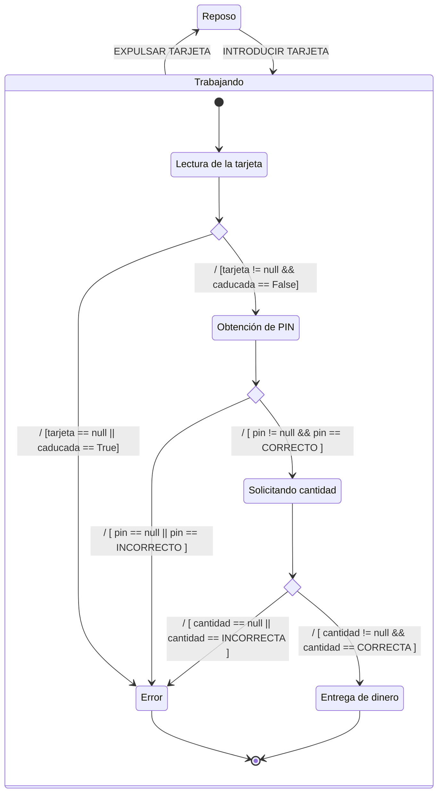

```mermaid
 stateDiagram-v2

    direction BT
    state condicion1 <<choice>>
    state condicion2 <<choice>>
    state condicion3 <<choice>>

    Lectura: Lectura de la tarjeta
    Pin: Obtención de PIN
    ostion: Error
    cantidad: Solicitando cantidad
    entrega: Entrega de dinero
    state Trabajando {
        [*] --> Lectura
        Lectura --> condicion1
        condicion1 --> Pin: / [tarjeta != null && caducada == False]
        condicion1 --> ostion: / [tarjeta == null || caducada == True]
        ostion --> [*]
        Pin --> condicion2
        condicion2 --> ostion: / [ pin == null || pin == INCORRECTO ]
        condicion2 --> cantidad: / [ pin != null && pin == CORRECTO ]
        cantidad --> condicion3
        condicion3 --> ostion: / [ cantidad == null || cantidad == INCORRECTA ]
        condicion3 --> entrega: / [ cantidad != null && cantidad == CORRECTA ]
        entrega --> [*]
    }

    Reposo --> Trabajando: INTRODUCIR TARJETA
    Trabajando --> Reposo : EXPULSAR TARJETA
```