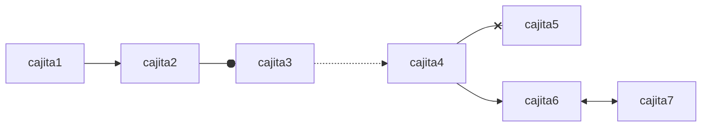
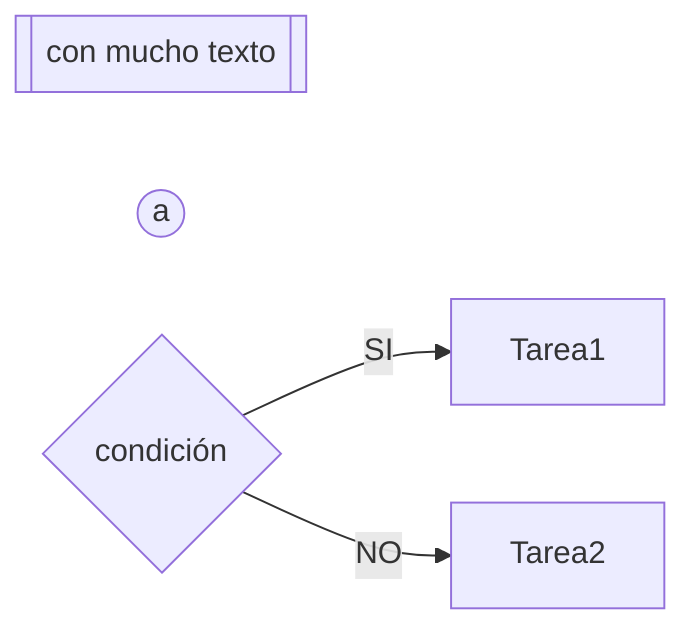
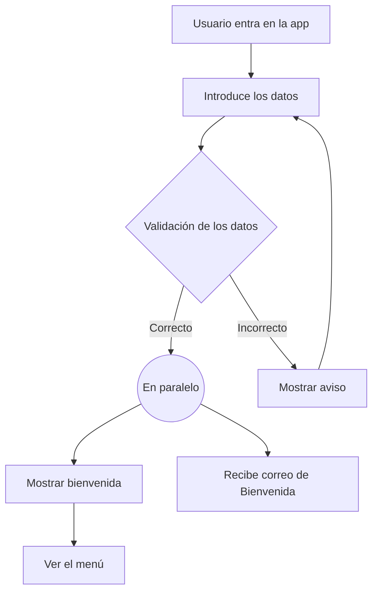
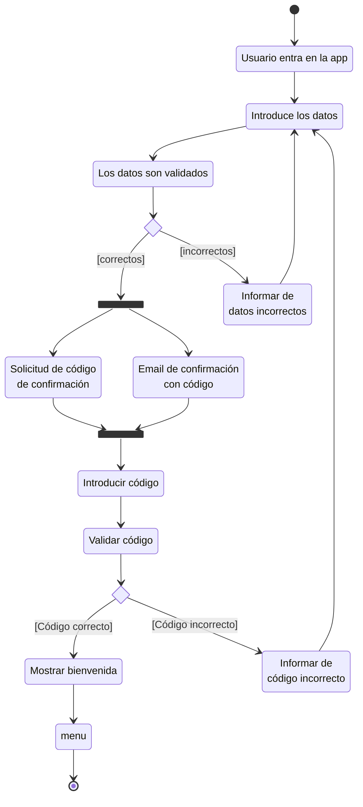

# Diagrama de actividad de la aplicación del teléfono móvil

Visualizaciones del flujo:
- TB/TD     : Top to Bottom / Top Down
- BT        : Bottom to Top
- RL        : Right to Left
- LR        : Left to Right

Las cajas representan tareas o acciones a realizar. Las flechas representan la dirección del flujo.

- Caja con bordes dobles a los lados: SUBRUTINAS
- Cajas circulares: CONECTORES
- Rombo: CONDICIONES (IF)

# Primera vez que el usuario entra en la aplicación

MERMAID ofrece un tipo de diagrama más especial para GRAFICOS DE ACTIVIDAD UML. Un poquito más complejo... pero con más posibilidades.

# DIAGRAMAS DE ESTADO de MERMAID para UML estricto

Estos diagramas me permiten una vista más enfocada en un Participante/Actor....
AUNQUE... También me permitirían añadir tareas que realicen otros participantes. 
PERO... en la práctica no lo hacemos (al menos abusando o de manera  generalizada).
POR QUE? Me complica mucho el diagrama... YA NO ES UN DIAGRAMA CLARO

# Los emojis son un idioma?

Llamamos lenguajes a los lenguajes de programación porque me permiten comunicarme con la computador = FALSO

Un abrazo comunica? MUCHISIMO
Y un emoji de un truño??? COMUNICA? TAMBIEN !!

No son lenguajes.
LOS EMOJIS SON UN ALFABETO !

Para tener un lenguaje necesito
- Un alfabeto
- Una reglas a cerca de cómo unir ese alfabeto para conceptos de más alto nivel (MORFOLOGIA)
- Un significado de esos constructos que hago de los elementos del alfabeto (SEMANTICA)
- Reglas para ver que constructos (palabra)pueden juntarse con qué constructos en según que condiciones (SINTAXIS)
   COMO ROJO

   TODO ELLO LO DEFINE UNA GRAMATICA = LENGUAJE(MORFOLOGIA + SEMANTICA + SINTAXIS + ALFABETO)

UML es un lenguaje... con su GRAMATICA (Regulada por una norma ISO)

Los lenguajes se clasifican en:
- LENGUAJES NATURALES (humanos)
    Tienen una reglas gramaticales muy flexibles
- LENGUAJES ARTIFICIALES/FORMALES (programación, uml)
    Tienen reglas gramaticales muy estrictas
        Y ESO LOS CONVIERTE EN MUY COMPLEJOS DE USAR PARA LOS HUMANOS

UML es un lenguaje FORMAL... y si me adhiero a esa FORMALIDAD (ESTA GUAY!, tan guay como usar el Español como Quevedo) se complica la cosa.

Ahora... me puedo relajar un poquito!