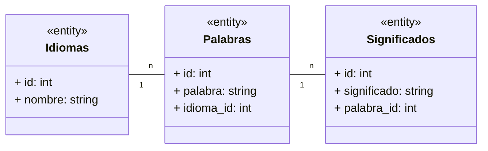

Los lenguajes de programación más usados:

- JS: Sequelize
- PYTHON: Alchemy
- JAVA: Hibernate
- C#: Entity Framework

---

Queries SQL
El hecho es que hoy en día cuando se trabaja con JAVA, PYTHON, C# o JS y se quieren guardar datos en una BBDD Relacional YA NO SE ESCRIBEN QUERIES SQL.
No hace falta ya aprender SQL para trabajar con BBDD Relacionales.

Tenemos librerías (ORM) que nos permiten trabajar con BBDD Relacionales sin escribir SQL... y que me dan funciones del tipo:
    Libreria.save(Objeto JAVA)
    Objeto JAVA = Libreria.findById(id)