# Diagrama de secuencia para sacar dinero en un cajero automático

HAPPY PATH: Es el camino feliz.-.. SI TODO VA COMO DEBERIA... Super bien!

Una vez montado este, identificamos los posibles problemas y los tratamos en el diagrama de secuencia.

```mermaid

sequenceDiagram

    actor                   U as Usuario
    participant             C as Cajero
    participant             S as Servidor

    U->>C:                  💳 Insertar tarjeta
    C->>C:                  Validar Tarjeta
           %% TODO: TARJETA NO SE PUEDE LEER
    C-->>U:                 Solicitar PIN
           %% TODO: NO ESCRIBE EL PIN

    rect rgb(255,255,230)
        note left of S:         VALIDACION DEL PIN
        U->>C:                  Escribe su PIN
        C->>+S:                 Solicitar validación del PIN de la tarjeta
        critical                Validar PIN
            alt PIN correcto
                S-->>C:         PIN correcto
            else PIN incorrecto
                S-->>C:         PIN incorrecto
            end
        option                  Servidor con problemas internos
            S-->>-C:             Notifica problemas internos
        option                  Timeout
        end

        opt                     Si ha habido timeout o problemas internos
            break               No se puede validar el PIN
                C-->>U:         💳 Entrega la tarjeta
                C-->>U:         No se puede procesar la operación
            end
        end
    end 

    C-->>U:                 Cuánto dinero?
    U->>C:                  Introduce la cantidad
           %% TODO: CANTIDAD INCORRECTA
           %% TODO: NO INTRODUCE CANTIDAD

           %% TODO: ADICIONAL (CONFIRMACION DE LA CANTIDAD)

           %% TODO: MULTIPLO DE UNA CANTIDAD
           %% TODO: NO HAY DISPONIBLE EN EL CAJERO

    C->>+S:                 Retirar importe solicitado
           %% TODO: NO HAY DISPONIBLE EN LA CUENTA
    S-->>-C:                OK
           %% TODO: SERVIDOR NO DISPONIBLE

    C-->>U:                 💳 Entrega la tarjeta
    C-->>U:                 💰 Entrega el dinero


```

# CRITICAL 

Hay tareas que pueden producir problemas potenciales, pero hasta que no intente hacer la tarea que puede producir el problema no se si el problema se va a a producir o no.

# ALT

HAY FLUJOS, que a priori me parecen problemas,
pero que no lo son realmente...

