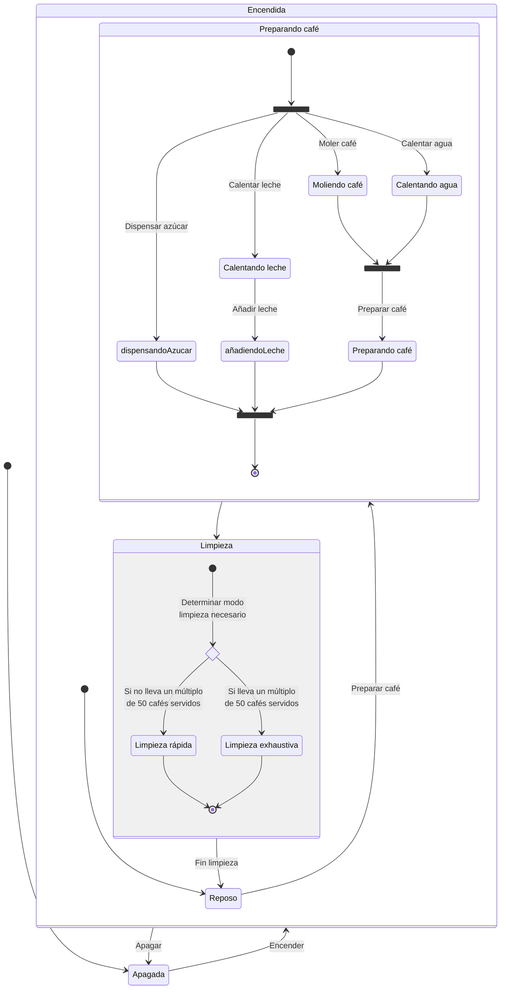
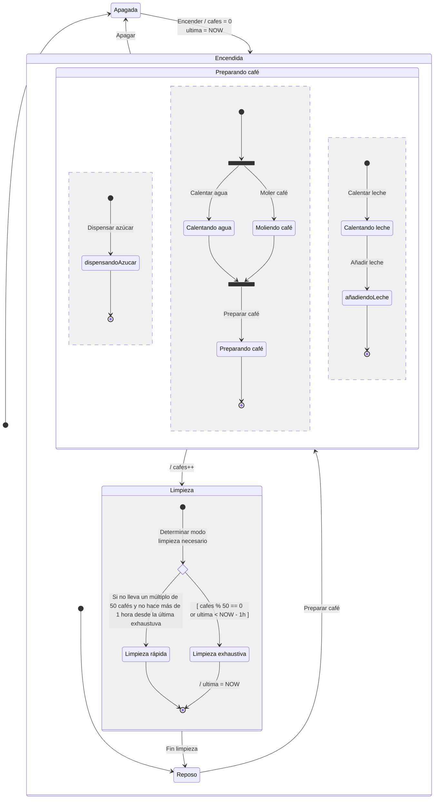
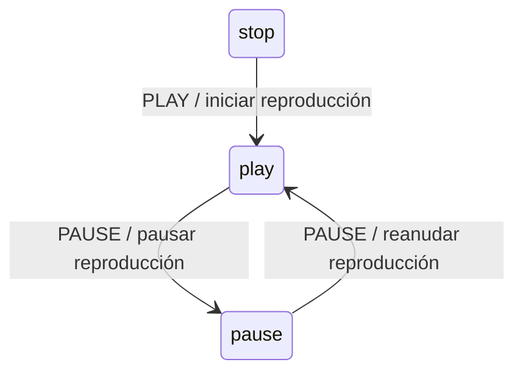

# Diagrama de Estado

Permite representar:
- Los estados en los que puede encontrarse un elemento
- Las transiciones entre los estados

- En UML además se definen estados COMPUESTOS
- Y Regiones Paralelas

Con estados montamos lo que llamamos MAQUINAS DE ESTADOS

Podemos modelar cualquier sistema mediante una máquina de estados. Lo que pasa es que hay sistemas tan complejos, que se hace muy difícil modelarlos con una máquina de estados.
Y en este caso busco formas alternativas de modelar (representar) el sistema

# Diagrama de estados de una máquina expendedora de café

La máquina puede estar encendida u apagada.
Si está encendida, puede estar:
- en reposo
- preparando café   ------+
        v                 | Cada 50 cafés... o si lleva 1 hora 
- en limpieza rápida      | desde la última limpieza exhaustiva
- en limpieza exhaustiva <+

Preparación del café:
- Calentar agua
- Moler café
- Hacer el cafe
- Calentar leche
- Echar leche
- Echar azucar

Cuando modelo una máquina de estados:
- Los estados SIEMPRE los nombro con un SUSTANTIVO o un ADJETIVO (Participio de un verbo) / GERUNDIO
- Las transiciones siempre las nombramos con INFINITIVOS de verbos
Tradicionalmente, las máquinas de estado se usaban para software embebido... para controladores de dispositivos.
Y había 2 grandes modelos para definir máquinas de estados:
- Moore
- Mealy
Para software más complejo, se quedaban pobres esos modelos... y UML extiende esos modelos con conceptos adicionales:
- Estados compuestos / jerárquicos

En los diagramas de actividad representamos TAREAS
    Las tareas se representan con VERBOS
En los diagramas de estados representamos ESTADOS
Y... en UML existe el concepto de Regiones Paralelas
De forma que un sistema, regido por una máquina de estados pueda estar simultáneamente en varios estados, siempre y cuando estén en regiones paralelas entre si

En los modelos tradicionales de máquinas de estados, solo se hablaba de esos 3 conceptos:
- Estado
- Transición
- Evento / Entrada

Evento: Algo que ocurre en el sistema y que provoca un cambio de estado.
Todo cambio de estado (TRANSICION) está provocado por un EVENTO

Puede ser que el mismo evento, en función del estado de la máquina provoque un cambio de estado u otro (distintas TRANSICIONES)

Radiocasette:

- Stop
- Play
- Pause

evento pulsar botón PAUSE
- Si está en PLAY, pasa a PAUSE
- Si está en PAUSE, pasa a PLAY

La idea es que desde fuera del sistema no se ejecutan TRANSICIONES INTERNAS en el sistema

Desde fuera se emiten eventos al sistema
Y esos eventos son los que dentro del sistema provocan transiciones.

## UML introduce otro concepto al modelar máquinas de estados: ESTADOS EXTENDIDOS

Más que estados extendidos el concepto es el de un CONTEXTO de la máquina de estados

Asociado a un máquina de estados puedo tener PROPRIEDADES que pueden influir en el comportamiento de la máquina de estados. En concreto en las transiciones.

## Guardias de transiciones

Condición que se evalúa en el momento de la transición para permitir o no la transición. Depende del estado en el que se encuentra la máquina de estados y de las propiedades del contexto de la máquina de estados (ESTADO EXTENDIDO)

## Acciones/Efectos asociados a transiciones

Cambios que pueden sufrir las propiedades de la máquina de estados al producirse una transición

---

% En muchos lenguajes de programación, el símbolo % se denomina operador MODULO / RESTO (MODULUS / REMAINDER)

Representa el resto de la división entera de un número entre otro.

Ejemplo: 165 % 50 = 15

    165 |  50
        +------
     15     3
     ^^
     % MODULO O RESTO