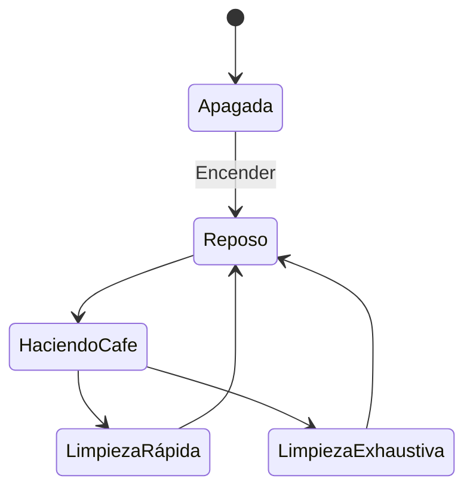

# Diagrama de Estado

Permite representar:
- Los estados en los que puede encontrarse un elemento
- Las transiciones entre los estados

- En UML además se definen estados COMPUESTOS
- Y Regiones Paralelas

Con estados montamos lo que llamamos MAQUINAS DE ESTADOS

Podemos modelar cualquier sistema mediante una máquina de estados. Lo que pasa es que hay sistemas tan complejos, que se hace muy difícil modelarlos con una máquina de estados.
Y en este caso busco formas alternativas de modelar (representar) el sistema

