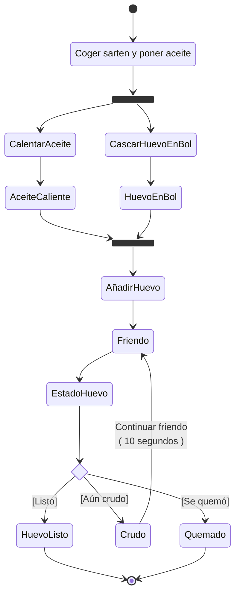
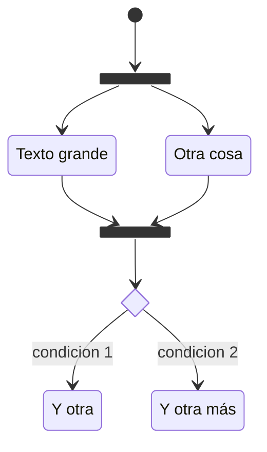

# A freir un huevo!

```mermaid
stateDiagram-v2

    state forkState <<fork>>
    state joinState <<join>>
    state Resultado <<choice>>

    sarten: Coger sarten y poner aceite

    [*] --> sarten

    sarten --> forkState

    forkState --> CalentarAceite
    forkState --> CascarHuevoEnBol

    CalentarAceite --> AceiteCaliente
    CascarHuevoEnBol --> HuevoEnBol

    AceiteCaliente --> joinState
    HuevoEnBol --> joinState

    joinState --> AñadirHuevo

    AñadirHuevo --> Friendo
    Friendo --> EstadoHuevo

    EstadoHuevo --> Resultado


    Resultado --> HuevoListo : [Listo]
    Resultado --> Crudo : [Aún crudo]
    Resultado --> Quemado : [Se quemó]

    Crudo --> Friendo : Continuar friendo<BR/> ( 10 segundos )
    HuevoListo --> [*]
    Quemado --> [*]


```

```mermaid

stateDiagram-v2

    state micondicion <<choice>>
    state inicioParalelo <<fork>>
    state finParalelo <<join>>

    a: Texto grande
    b: Otra cosa
    c: Y otra
    d: Y otra más

    [*] --> inicioParalelo
    inicioParalelo --> a
    inicioParalelo --> b
    a --> finParalelo
    b --> finParalelo
    finParalelo --> micondicion
    micondicion --> c : condicion 1
    micondicion --> d : condicion 2

```