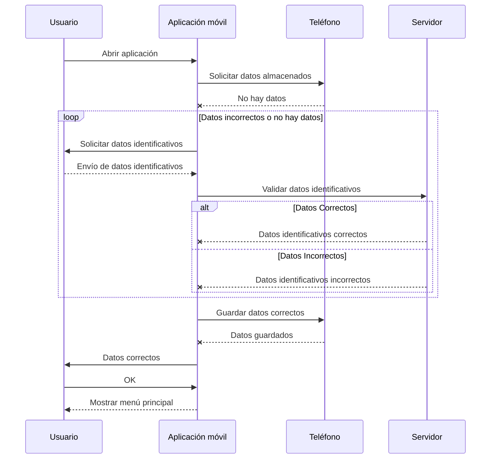

# Diagramas de secuencia

Nos permite representar como componentes de un sistema interactúan entre si a lo largo del tiempo para realizar una tarea concreta.

Lo primero es representar los ACTORES/PARTICIPANTES en el diagrama. 
Esos participantes van a tener comunicaciones entre si, que posteriormente definiremos en el diagrama.

## Ejemplo 1:

Montamos la secuencia de interacciones entre una persona (usuario) de una aplicación de teléfono móvil y un servidor.

Esta secuencia describe el flujo de interacción entre un usuario, una aplicación móvil, el teléfono que ejecuta la aplicación, y un servidor para validar y guardar los datos identificativos. A continuación, te explico cada paso:

1. **Usuario abre la aplicación móvil**:
   - El usuario inicia el proceso abriendo la aplicación en su dispositivo móvil.

2. **La aplicación móvil solicita los datos almacenados en el teléfono**:
   - La aplicación intenta recuperar datos previamente guardados en el teléfono.

3. **El teléfono informa que no hay datos almacenados**:
   - El teléfono responde a la aplicación indicando que no tiene datos guardados.

4. **Bucle: la aplicación solicita datos identificativos**:
   - Como no hay datos o los datos son incorrectos, la aplicación solicita al usuario que ingrese sus datos identificativos, como nombre de usuario y contraseña.

5. **El usuario envía los datos identificativos**:
   - El usuario introduce los datos solicitados y los envía a la aplicación móvil.

6. **La aplicación envía los datos al servidor para validación**:
   - La aplicación móvil transmite estos datos al servidor para verificar su validez.

7. **Condición: datos correctos o incorrectos**:
   - El servidor responde indicando si los datos identificativos enviados son correctos o incorrectos.
   - **Caso de datos correctos**: El servidor confirma que los datos son correctos.
   - **Caso de datos incorrectos**: El servidor indica que los datos proporcionados son incorrectos.

8. **Guardar datos correctos en el teléfono**:
   - Si los datos son correctos, la aplicación guarda esta información en el teléfono.

9. **El teléfono confirma que los datos han sido guardados**:
   - El teléfono responde a la aplicación móvil confirmando que ha guardado los datos correctamente.

10. **La aplicación notifica al usuario que los datos son correctos**:
    - La aplicación informa al usuario que los datos ingresados son válidos.

11. **El usuario confirma la validación de los datos**:
    - El usuario responde con una confirmación, indicando que está conforme con el proceso.

12. **La aplicación muestra el menú principal**:
    - Finalmente, la aplicación presenta su menú principal, dando al usuario acceso a sus funcionalidades.

Este flujo cubre los pasos desde la apertura de la aplicación hasta la validación y almacenamiento de los datos identificativos del usuario en el dispositivo, asegurándose de que estos sean correctos antes de dar acceso a las funcionalidades principales de la aplicación.

## Ejemplo 2: Tipos de comunicaciones/interacciones en UML

NOTA: Las interacciones con linea continua: Se producen en el tiempo al ocurrir un evento que dispara la interacción.
Las interacciones con linea discontinua: Se producen como consecuencia de una interacción previa.

# Interacción asíncrona

Las comunicaciones pueden ser síncronas o asíncronas.

- Síncronas: El emisor espera una respuesta del receptor antes de continuar.
- Asíncronas: El emisor no espera una respuesta inmediata del receptor y puede continuar con otras tareas.

La decisión de usar una comunicación Síncrona o Asíncrona muchas veces viene marcada por la funcionalidad u otros requisitos de un sistema

> Ejemplos:

>> Ejemplo 1: Pago con tarjeta por TPV en un supermercado: MERCADONA

El programa que esté en el TPV (Terminal Punto de Venta) de Mercadona, envía la información de la tarjeta de crédito/débito/prepago al banco para que este la valide y cobre. 
Debe esperar el programa del mercadona la respuesta del BANCO? Sí, porque si no hay respuesta, no me puedo ir con la compra.
COMUNICACION SINCRONA!

Qué pasaría si se ha caído la pasarela de pago del banco?
EL BANCO NO CONTESTA... me jodo y me voy sin compra. QUE CABRONES !!!

>> Ejemplo 2: Pago con tarjeta en un peaje

El programa que esté en el TPV (Terminal Punto de Venta) del peaje, envía la información de la tarjeta de crédito/débito al banco para que este la valide y cobre. 
Debe esperar a que el banco responda? NO
COMUNICACION ASINCRONA!

Qué pasaría si se ha caído la pasarela de pago del banco?
Que una ambulancia que lleva a un tio con un infarto se muere!!!

Lo que ocurre es que simplemente se anota ese cargo...
Y se trata de procesar en el futuro.
Por eso no me dejan usar tarjetas prepago... que son anónimas mucahas de ellas.
