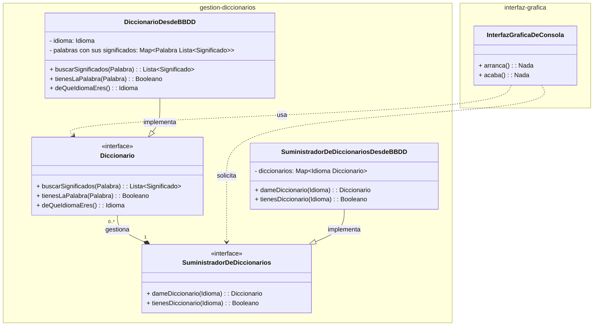

# Paradigmas de programación

Los lenguajes de programación usan distintos paradigmas de programación.

Un paradigma no es sino un nombre hortera que alguien se le ocurrió para referirse a una forma de usar un lenguaje.
De hecho ni siquiera es algo propio de los lenguajes de programación este concepto. Los tenemos también en lo que llamamos los lenguajes NATURALES: ESPAÑOL, INGLÉS, FRANCÉS, etc.

## Lenguajes humanos... y sus "paradigmas"

- Felipe, pon una silla debajo de la ventana.           IMPERATIVO: ORDEN
- Felipe, debajo de la ventana, ha de haber una silla.  FRASE/ORACIÓN/SENTENCIA ENUNCIATIVA (en la programación sería una STATEMENT declarativa)
    Al usar este paradigma, DELEGO en Felipe la responsabilidad de llegar/conseguir el estado que yo deseo... y me olvido de lo que Felipe debe hacer para llegar hasta ahí.
- Felipe, ejecuta el procedimiento colocarSillaDebajoDeLaVentana... Lo tiene ahí explicadito en el manual... no te lo te lo voy a explicar YO. PROCEDURAL

Los lenguajes soportan varios paradigmas a la vez. 
Por ejemplo:
- C es un lenguaje imperativo, procedural y funcional. 
- Java  es un lenguaje imperativo, procedural, funcional y orientado a objetos. Además, algunas librerías me permiten programar de forma declarativa.
- Python, JS, C#... también, como JAVA

## Paradigmas de programación:

- Paradigma imperativo              Le damos a la computadora ORDENES: Statement que son ORDENES
                                    Estamos muy acostumbrados a hablar con las computadoras así.
                                        mkdir: make directory: En inglés esta frase es imperativo.
                                        cd:    change directory: En inglés esta frase es imperativo.
                                        print: En inglés esta frase es imperativo.
                                    ES UNA MIERDA ! HABLAR ASI !!!

                                    Felipe, si (IF) hay algo debajo de la ventana siempre y cuando (AND NOT) no sea una silla
                                        QUITALO!                                            Orden
                                    Felipe, si (IF) debajo de la ventana no (NOT) hay una silla: ENTONCES (then)
                                        IF(SI) no hay sillas,
                                            THEN(ENTONCES) vete al ikea y te compras una silla. Orden
                                        Felipe, pon una silla debajo de la ventana.             Orden

                                    El problema al usar un lenguaje imperativo es que pierdo de vista mi objetivo... y paso a centrarme en lo que alguien debe hacer para conseguir ese objetivo.

                                    Felipe (nuestra computadora) es buena gente! Muy servicial.. pero un poco cortito.
- Paradigma procedural              Es cuando el lenguaje me permite agrupar ordenes bajo un concepto llamado:
                                    - procedimientos
                                    - rutinas
                                    - funciones
                                    - métodos
                                    - subrutinas
                                    Y posteriormente solicitar su ejecución, entonces digo que tengo un lenguaje que soporta programación procedural. 
- Paradigma funcional
- Paradigma Orientado a Objetos     Este es harto fácil de entender.

                                    Los programas, cualquiera manejan DATOS. Los lenguajes de programación nos ofrecen una serie de tipos de datos que podemos usar:

                                                                    Cada dato, dependiendo de su tipo tiene:
                                                                    sus cosas que lo caracterizan.                          operaciones permitidas
                                                                    Que diferencian a un dato de otro del mismo tipo.
        - Números enteros                                           valor, signo                                            + - * signo()
        - Números decimales                                         parte entera, parte decimal, signo
        - Cadenas de texto                                          secuencia de caracteres                                 ponteEnMayusculas()
                                                                                                                            longitud()
                                                                                                                            dame los 3 primeros caracteres
        - Valores lógicos (TRUE/FALSE)
        - Listas de números (array, set, sequence, list, vector)
        - Tabla de números (matrix, map, array multidimensional)
        - Fecha                                                     día, mes, año                                           dameElDía()         
                                                                    10 de Septiembre de 2021                                caeEntreSemana()
                                                                                                                            pertenece a un año bisiesto??

        El problema es que todos los lenguajes me dan un conjunto concreto de tipos de datos y operaciones que puedo hacer con ellos.
        Y qué pasa si quiero tener mis propios TIPOS DE DATOS:
        - Cliente                                                   nombre, apellidos,                                      dar de baja()
                                                                    dni, dirección, teléfono, email                         facturar()

        Cuando el lenguaje me da la posibilidad de crear mis propios tipos de datos, con sus propias características(estado) y operaciones(métodos) que puedo hacer con ellos, entonces digo que tengo un lenguaje que soporta programación orientada a objetos.

- Paradigma Declarativo

# Hay una serie de principios que debemos tener en cuenta cuando usamos un paradigma de programación Orientado a Objetos: Principios SOLID

No es obligatorio. En cualquier caso son NORMAS. Puedo escribir un código que respete estos principios, o puedo escribir un código que no los respete.
Los principios son solo eso. PRINCIPIOS QUE PUEDO RESPECTAR O NO.
Lo que pasa es que decido y me esfuerzo por respetarlos, tengo más confianza en escribir un código más mantenible, más escalable, más fácil de entender, más fácil de probar = MEJOR !

Son 5:
    S: Single Responsability Principle - Principio de Responsabilidad Única:
        Un componente de mi sistema debe tener / asumir una única responsabilidad. Eso implica a su vez que tendrá una única razón para ser cambiado.
    O: Open/Closed Principle - Principio de Abierto/Cerrado
    L: Liskov Substitution Principle - Principio de Sustitución de Liskov
    I: Interface Segregation Principle - Principio de Segregación de Interfaces
    D: Dependency Inversion Principle - Principio de Inversión de Dependencias
        Un componente no debería NUNCA de depender de una implementación de otro componente, en su lugar, ambos deberían depender de una abstracción.

---

> Ejemplo: Queremos montar una aplicación de consola (comando) que, al darle un idioma y una palabra me entregue los significados de esa palabra en ese idioma.

Ese programa le podría montar usando un paradigma imperativo, procedural, funcional, orientado a objetos, declarativo... o una mezcla de todos ellos.
Por ejemplo: IMPERATIVO: 
1- Print("Dame un idioma")
2- Leer(idioma)
3- Print("Dame una palabra")
4- Leer(palabra)
4.5- Declara la variable ENCONTRADA = FALSE
5- Abre fichero de idioma (el que te he dicho) y ve linea a linea (BUCLE)
    6. Cuando llegues a la línea que empieza por la palabra que me han dado (IF)
       1. Toma lo que hay detrás de la palabra y me lo imprimes (PRINT) que son los significados
       2. ENCONTRADA = TRUE
8- Si (IF) NO ENCONTRADA
    9- Print("No se ha encontrado la palabra")

Pregunta. Este programa respecta el principio de Responsabilidad Única?
Ni de lejos. Tengo un único componente (mi programa) que hace muchas cosas:
- Leer datos de la pantalla y escribirlos (interacción con el usuario)
- Abrir ficheros, leerlos... gestionar los significados

IMPACTO/CONSECUENCIAS:
- Si quiero cambiar el programa para que ahora en lugar de leer ficheros con los significados, los busque en una BBDD, tengo un sitio controlado donde se hace solo eso? NO -> OJITO AL TOCAR EL PROGRAMA... que como la lies y toques lo que no debes... te cargas el programa y te deja de funcionar la interacción con el usuario.
El programa que hemos montado es DIFICIL DE MANTENER Y EVOLUCIONAR. Hace demasiadas cosas.

VAMOS A PLANTEARLO DIFERENTE.
Si quisierais hacer esto en la vida real (buscar los significados de una palabra en un idioma) que usaríais? DICCIONARIO
De donde saco el DICCIONARIO? De la tienda/biblioteca/Amazon. Alguien que me pueda proveer de esos diccionarios.

Voy a definir componentes en mi aplicación, que me faciliten el entenderla y el asignar responsabilidades únicas a cada uno de ellos.... y esto lo puedo hacer a varios niveles.

App de CONSOLA que me ofrece los significados de una palabra en un idioma:
- Componente: Interfaz de usuario - Responsabilidad: Interactuar con el usuario (capturar datos y mostrar resultados)
    Tipo de datos: InterfazDeLaAplicacion: Clase
- Componente: Suministrador de diccionarios - Responsabilidad: Proveerme de los diccionarios
    Tipo de datos: SuministradorDeDiccionarios: clase
    - Qué caracteriza a un suministrador de diccionarios?
      - Qué diccionarios puede proveerme
    - Qué le puedo preguntar a un suministrador de diccionarios? Cómo puedo usar el suministrador de diccionarios/para qué?
      - dameDiccionario(idioma) -> Diccionario
      - tienesDiccionario(idioma) -> TRUE/FALSE
      - dameIdiomasDeLosQueTienesDiccionario() -> Lista de Idiomas
- Componente: Diccionario - Responsabilidad: Buscar los significados de una palabra en el idioma de ese diccionario
    Tipo de datos: Diccionario - clase = TIPO NUEVO DE DATOS que yo defino en el lenguaje de programación
    - Qué caracteriza a un diccionario?                                                     ATRIBUTOS/PROPIEDADES
      - IDIOMA
      - PALABRAS Y SIGNIFICADOS QUE CONTIENE
    - Qué le puedo preguntar a un diccionario? Cómo puedo usar el diccionario/para qué?     MÉTODOS O FUNCIONES
      - buscarSignificados(palabra) -> Lista de Significados 
      - tienesLaPalabra(palabra) -> TRUE/FALSE - me dice si la palabra está en el diccionario
      - deQueIdiomaEres() -> Idioma - me dice el idioma del diccionario
 
Seguimos aplicando el principio de Responsabilidad Única dentro de cada uno de los componentes que hemos definido.
Dentro tienen funciones/métodos que hacen una única cosa - que tienen una única responsabilidad.

Y de nuevo, esto me ayuda a montar un sistema más fácil de entender, de mantener, de evolucionar, de probar.
Entendiendo que es cada cosa... y cuál es su objetivo. Por qué está ahi?

# UML nos permite definir diagramas de clases que nos ayudan a entender cómo se relacionan los distintos componentes de un sistema.
Nos ayuda a modelar un sistema de forma gráfica, usando un paradigma orientado a objetos.

Teniendo en cuenta que una Palabra, un Idioma o un Significado son textos.

En programación Orientada a objetos, tenemos un concepto que es el de ENCAPSULACION de propiedadades.
Cada propiedad puede ser leída y/o modificada por otros componentes del sistema.
- Cuando componentes externos a otro componente no deben poder modificar una propiedad o no deben poder leerla, entonces debemos definir esa propiedad como PRIVADA
- Cuando componentes externos a otro componente deben poder leer una propiedad y modificarla, entonces debemos definir esa propiedad como PUBLICA

En UML eso se simboliza con los signos + y - delante de la propiedad.
* PRIVADA = -
* PUBLICA = +

Igual que pasa con las propiedades, las funciones serán accesibles desde fuera del comonente o no: PUBLICAS o PRIVADAS. 

---

# Mapa (array asociativo, diccionario)

Es una estructura de datos que nos permite manipular una tabla de 2 columnas: donde una es una clave única, a la que conceptualmente se asocia el valor de la otra columna.

    | Palabra | Significados       |
    |---------|--------------------|
    | melón   | Fruto del melonero |
    | manzana | Fruto del manzano  |

    | Idioma  | Diccionario          |
    |---------|----------------------|
    | es      | Disccionaro Larousse |
    | en      | Cambridge Dictionary |

---

# Relaciones entre clases / componentes, en un diagrama UML

- Composición: Una clase contiene a otra clase. La clase contenida no tiene sentido sin la clase contenedora. La vida de la clase contenida depende de la clase contenedora.
- Dependencia: Cuando una clase necesita de otra clase para realizar su trabajo. 

---

# Lenguajes más usado a nivel mundial:

- Javascript
- Python
- Java
- C/C++/C#
Salvo C, todos los demás de esa lista son lenguajes que soportan Programación Orientada a Objetos.... de hecho es el paradigma más usado en esos lenguajes.

---

# D: Dependency Inversion Principle - Principio de Inversión de Dependencias

Un componente no debería NUNCA de depender de una implementación de otro componente (de un tipo concreto-clase de un componente), en su lugar, ambos deberían depender de una abstracción (interfaz).

## Qué es eso de una abstracción?

Una abstracción representa la esencia de unos tipos de datos (clases).

Llevando al ejemplo de los diccionarios:
- A la aplicación de consola le da igual si le pasamos un diccionario en Papel, o un diccionario cuyas palabras estén en ficheros, o un diccionario cuyas palabras esté guardadas en una BBDD. Le es y le debe ser indiferente.

Qué tienen en común?
- diccionario en Papel
- diccionario cuyas palabras estén en ficheros
- diccionario cuyas palabras esté guardadas en una BBDD

* Todos tienen un idioma asociado? Sí
* Todos tienen palabras con sus significados? Sí
* A todos les puedo preguntar por los significados de una palabra? Sí
* A todos les puedo preguntar si tienen una palabra? Sí
* A todos les puedo preguntar de qué idioma son? Sí

Qué los diferencia?
* El soporte físico donde se guardan las palabras y significados

Me importa a mi el soporte físico donde se guardan las palabras y significados para poder preguntar a un diccionario por los significados de una palabra? NO
Y DEBE DARME IGUAL... Si no, tengo un problema. Si solo se usar diccionarios con soporte en papel... el día que en su lugar me pasen un diccionario con soporte en ficheros... no voy a poder buscar los significados de una palabra.

Eso que tienen en común cualquier tipo de diccionario es lo que denominamos:
- Una abstracción
- Una interfaz
- Un contrato

Ese conjunto de cualidades (atributos) y operaciones que puedo hacer sobre un diccionario, es lo que define el concepto ABSTRACTO de lo que es diccionario.

Luego hay tipos de diccionarios CONCRETOS:
- DiccionarioEnPapel
- DiccionarioEnFicheros
- DiccionarioEnBBDD
Pero todo ellos son diccionarios.

Pregunta:
- En un diccionario cuyas palabras estuvieran en papel, el procedimiento de búsqueda de una palabra, será el mismo que si las palabras estuvieran en ficheros o en una BBDD? NO
  - En papel, para buscar una palabra, parto a la mitad el diccionario... miro la palabra que está en medio... si la palabra que busco está antes, me quedo con la primera mitad... si está después, me quedo con la segunda mitad... y vuelvo a partir a la mitad... y así hasta encontrar la palabra.
  ALGORITMO DE BÚSQUEDA BINARIA
  - En fichero, abro el fichero... y voy de principio a fin... hasta encontrar la palabra.

Ahora... si he dicho que a un diccionario puedo preguntarle si contienen una palabra, a mi me da igual cómo internamente realice la búsqueda de esa palabra. Eso es un detalle de implementación particular de cada tipo de diccionario. 
A mi, mientras sea capaz de proporcionarme los significados de una palabra, me da igual cómo lo haga. 

DiccionarioDesdeFicheros implementa la interfaz Diccionario
ES IGUAL A DECIR EN LENGUAJE HUMANO
DiccionarioDesdeFicheros es un tipo concreto de Diccionario

---

En UML se hablan de algunos conceptos adicionales:
- Entidad: Un tipo muy especial de clase, que solo tiene propiedades y no lógica asociada (funciones/métodos)
- Servicio: Un tipo de clase que solo tiene lógica asociada (funciones/métodos) y de la cuál solo vamos a necesitar una instancia en todo el sistema ( 1 dato de ese tipo)

Otro concepto es con los modificadores de privacidad:
Propiedades / Métodos:
- PUBLIC: +
- PRIVATE: -
- PROTECTED: #
- INTERNAL: ~

Ver los distintos tipos de relaciones entre clases:
- Implementación: Una clase implementa una interfaz
- Dependencia: Una clase que necesita una dato de un tipo (interfaz) para poder realizar su trabajo
- Composición: Una clase contiene a otra clase. La vida de la clase contenida depende de la clase contenedora: Los diccionarios dependen de los suministradores de diccionarios. Controlan su vida.
- Agregación
- Vincluación

Además UML marca el concepto de Namespace, que es un espacio de nombres:
Es una forma de agrupar conceptualmente clases/interfaces que tienen algo en común:
que responden a una responsabilidad única de más alto nivel